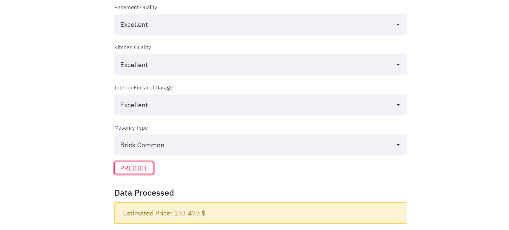

# HousePrice-Prediction-Deployment

## About this Repository:
* This repo contains all the files used in deploying the model.
* The web-app was created using _**Streamlit**_ and deployed on _**Heroku**_ cloud.

### Links:
* [*Web-App*](https://home-prices-predictor.herokuapp.com)
* [*Code, Jupyter Notebook*](https://github.com/MisbahullahSheriff/ML-Projects/tree/master/HousePrice-Predictor)

### Glimpse of the Application:

**---------- IMPORTANT NOTE --------**
* If the web-app throws an **error** message as shown below, it's probably due to the monthly limitation provided by Heroku being exceeded.
* Please try opening the web-app again at the start of the new month.

 

**Checkout the application!**   
**Give this repo a :star: if you liked my work.**

### Thank You!:smiley:
